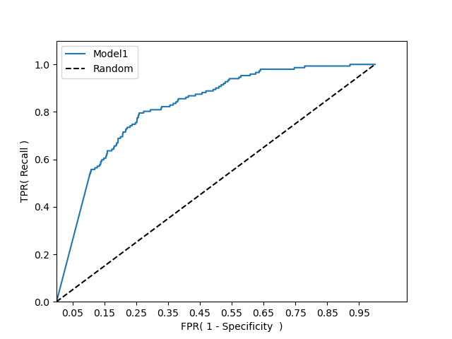
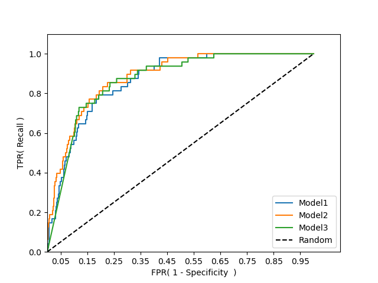
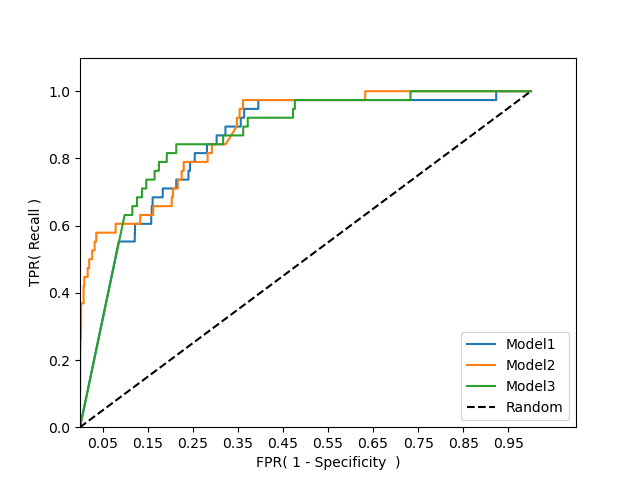
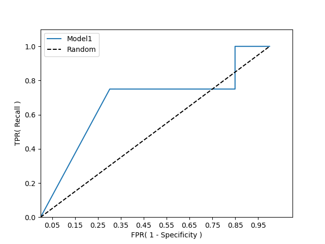
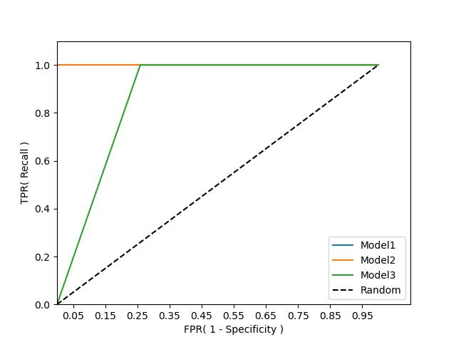
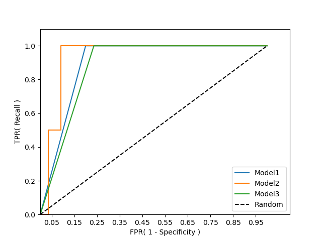

# KNN_code

### Notice
#### DataSet is not available.

## 1. Codes
### Codes for training          -> ./only12
### Codes for training results  -> ./roc_curve_12
### Codes for test              -> ./test_results

## 2. ROC for validation
### NEC

### NEC-IP

### SIP

## 3. ROC for test set
### NEC

### NEC-IP

### SIP

